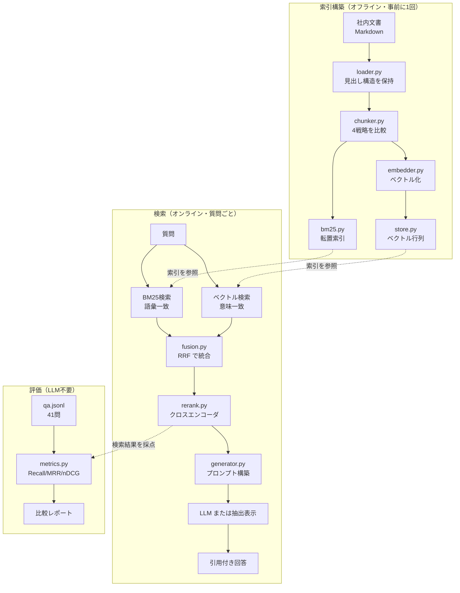

# rag-workshop — RAG を自分で組んでアーキテクチャを理解する

> [!IMPORTANT]
> **`data/corpus/` の文書はすべて架空です。当社の実在する規程ではありません。**
> 検索の難しさを再現するため、実際の社内規程の体裁を模して作成した**学習用のダミー文書**です。
> 記載されている手当額・締切・承認フロー等に一切の効力はありません。
> **業務上の判断の根拠として引用しないでください。**

社内文書検索を題材に、**RAG の各工程を自前実装して比較評価する**学習用リポジトリ。

ベクトルDBもLangChainも使わない。Chroma/FAISS/LangChain が内部で何をしているのかを、
自分の手で書いて確かめることを目的にしている。
検索の中核（BM25・ベクトルストア・RRF・評価指標）はすべて 30〜80 行のスクラッチ実装。

**評価用Q&Aを41問同梱しているため、変更の効果をすべて数値で確認できる。**

---

## 3行でわかる結論

1. **最も効いたのはチャンク分割の見直し**（MRR 0.605 → 0.927）。モデル変更より先にここを見る。
2. **ハイブリッド検索は常に勝つわけではない**。このコーパスでは密ベクトル単独に負けた。
3. **クロスエンコーダのリランクが最も強い**（MRR 0.978）が、レイテンシは 50 倍になる。

---

## クイックスタート

```bash
python3 -m venv .venv && ./.venv/bin/pip install -r requirements.txt
```

```bash
./.venv/bin/python steps/step1_naive_rag.py
```

```bash
./.venv/bin/python -m evaluation.run_eval --cross-encoder
```

```bash
./.venv/bin/python demo.py
```

APIキーは不要。初回のみ埋め込みモデル（約470MB）を自動ダウンロードする。
`--llm` を付けたときだけ Claude API を使う（`ANTHROPIC_API_KEY` が必要）。

---

## アーキテクチャ



設計上の要点は3つ。

**索引構築と検索の分離。** 埋め込みは索引構築時に1回だけ行う。
検索時に必要なのはクエリ1本のベクトル化（実測 6ms）だけで、文書側は計算済み。
バイエンコーダを使う理由はここにある。

**検索器の合成可能性。** すべての検索器が `search(query, top_k) -> [(index, score)]` を実装する。
ハイブリッドもリランクも「検索器を包む検索器」として書けるため、
構成の組み替えが1行で済み、公平な比較ができる。

**生成レイヤの差し替え可能性。** 生成器を変えても検索精度は1ミリも変わらない。
逆に検索が正解を拾えなければ、どんなモデルでも正しく答えられない。
この非対称性を実装の形で示すために、生成を末端の差し替え点に隔離している。

---

## 学習ステップと実測結果

### Step 1 — 素朴な RAG（`steps/step1_naive_rag.py`）

固定長分割 + TF ベクトル + cosine 類似度。入門記事によくある実装。
ragkit を使わず1ファイル・標準ライブラリ+numpy だけで書いてある。

実行すると、「在宅勤務の手当はいくらですか」と
「家で働くとお金はもらえますか」で**結果が変わる**ことが確認できる。
同じ意味の質問でも語彙が違えば別物として扱われる。これが語彙一致検索の限界。

| 構成 | MRR | Recall@1 | Recall@5 |
|---|---:|---:|---:|
| S1 固定長 + TF-IDF | 0.605 | 0.355 | 0.823 |

### Step 2 — チャンク戦略（`ragkit/chunker.py`）

埋め込みモデルを E5 に固定し、**分割方法だけ**を変えて比較した。

| 戦略 | MRR | Recall@1 | 見出し跨ぎ率 |
|---|---:|---:|---:|
| fixed（固定長300字） | 0.806 | 0.613 | 75.9% |
| fixed_overlap（+100字重複） | 0.781 | 0.565 | 72.1% |
| heading（見出し単位） | 0.808 | 0.629 | 0% |
| **heading_context（見出し単位 + 文脈ヘッダ）** | **0.927** | **0.742** | 0% |

**この一手が全工程で最大の改善だった（MRR +0.12、Recall@1 +0.11）。**

heading_context がやっているのは、埋め込む文章の先頭に1行足すだけ。

```
リモートワーク規程 > 6. 通信費および設備の補助
在宅勤務手当として月額5,000円を支給する。…
```

セクション本文だけを埋め込むと「何についての5,000円か」が本文中に無い。
文書タイトルと見出しを添えるだけで、チャンクが単体で意味を持つようになる。
`chunker.py` で `text`（LLMに渡す）と `embed_text`（ベクトル化する）を
別フィールドにしているのはこのため。**この2つは同じである必要がない。**

一方、オーバーラップは**効かなかった**（むしろ MRR が下がった）。
見出し単位で切れていれば境界の分断が起きないため、
オーバーラップが解決する問題自体が消えている。
「とりあえずオーバーラップを入れる」は、分割が構造に沿っていれば不要。

### Step 3 — 検索方式とハイブリッド（`ragkit/bm25.py`, `fusion.py`）

| 構成 | MRR | Recall@1 | Recall@5 | 遅延 |
|---|---:|---:|---:|---:|
| BM25 単独（素朴 w=1.0） | 0.698 | 0.500 | 0.758 | 0.0ms |
| BM25 単独（機能語減衰 w=0.2） | 0.855 | 0.661 | 0.919 | 0.0ms |
| Dense 単独（LSA / numpyのみ） | 0.673 | 0.468 | 0.758 | 0.0ms |
| Dense 単独（E5） | **0.927** | **0.742** | 0.919 | 6.0ms |
| Hybrid RRF | 0.919 | 0.742 | 0.919 | 6.1ms |
| Hybrid 加重和 | 0.919 | 0.742 | 0.935 | 6.0ms |

**日本語 BM25 の落とし穴。** 素朴に実装すると `MRR 0.698` しか出ない。
原因は質問文の定型表現（`ですか` `とは` `は何`）で、
Q&A 形式の文書（オンボーディングFAQ）に高頻度で出現するため、
**質問文の「型」が内容語を押し負かす**。
コーパスが小さいと IDF が十分に下がらず（`ですか`=2.08 vs `vaultteam`=2.87）自動的には解決しない。

クエリ側でひらがな専用トークンを 0.2 倍に減衰させるだけで `MRR 0.855` まで改善した。
索引側ではなくクエリ側を触るのは、索引側で語を削ると文書長 |d| が変わり
BM25 の長さ正規化が歪むため。

**ハイブリッドは自動的に勝たない。** RRF も加重和も、密ベクトル単独（0.927）を
上回れなかった（0.919）。BM25 側が相対的に弱いため、統合が足を引っ張っている。
ハイブリッドは「両方が同程度に強い」ときに効く手法であって、万能薬ではない。
**必ず単独構成と比較してから採用すること。**

なお LSA（TF-IDFをSVDで128次元に圧縮、numpyのみ）は E5 に大きく負けた（0.673 vs 0.927）。
密ベクトルという形式が効くのではなく、**Web規模の事前学習が効いている**ことが分かる。

### Step 4 — リランク（`ragkit/rerank.py`）

| 構成 | MRR | Recall@1 | Recall@5 | 遅延 |
|---|---:|---:|---:|---:|
| Hybrid RRF（1段のみ） | 0.919 | 0.742 | 0.919 | 6.1ms |
| + MMR（λ=0.7） | 0.925 | 0.742 | 0.919 | 12.0ms |
| + MMR（λ=0.5） | 0.899 | 0.742 | 0.790 | 13.0ms |
| **+ CrossEncoder** | **0.978** | **0.839** | **0.952** | 307.0ms |
| Dense + CrossEncoder | 0.978 | 0.839 | 0.952 | 297.3ms |

**クロスエンコーダが最強、ただしレイテンシ 50 倍。**
バイエンコーダはクエリと文書を独立にベクトル化するため文書側を事前計算できるが、
両者の相互作用を見られない。クロスエンコーダは `[クエリ; 文書]` を連結して推論するため
精度は高いが、検索のたびに候補数だけ推論が要る。だから2段構えにする。

**Hybrid+CE と Dense+CE のスコアが完全に一致した。**
候補20件の中に正解が入ってさえいれば、1段目の細かい順位差はリランカが吸収してしまう。
つまり**1段目に求められるのは順位の精度ではなく候補の再現率**であり、
1段目のチューニングに時間をかけるより2段目を入れるほうが費用対効果が高い。

**MMR は λ の設定を誤ると悪化する。** λ=0.5 で多様性を上げすぎると
Recall@5 が 0.919 → 0.790 に落ちた。特に distractor 型の質問で 0.88 → 0.62 と大きく劣化。
多様性は関連性とのトレードオフであり、無条件に良いものではない。

### Step 5 — 評価とハルシネーション対策（`evaluation/`）

**検索の精度は LLM なしで測れる。** 正解データ（`data/eval/qa.jsonl`）さえあれば
Recall / MRR / nDCG は純粋な計算で求まる。RAG の失敗の大半は検索段で起きるため、
まずここを数値化するのが費用対効果として最も高い。

質問は5タイプに分類してあり、手法の得意不得意が分解して見える。

| 構成 | lexical | semantic | multi_doc | distractor | numeric |
|---|---:|---:|---:|---:|---:|
| S1 固定長+TF-IDF | 0.80 | 0.73 | 0.70 | 1.00 | 1.00 |
| BM25（素朴） | 0.60 | 0.68 | 0.70 | 0.88 | 1.00 |
| Dense（E5） | 1.00 | 0.91 | 0.80 | 0.88 | 1.00 |
| Hybrid RRF | 1.00 | 0.86 | 0.90 | 0.88 | 1.00 |
| Hybrid + CrossEncoder | 1.00 | 0.95 | 0.90 | 0.88 | 1.00 |

`multi_doc`（複数文書にまたがる質問）でハイブリッドが密ベクトル単独を上回っている
（0.90 vs 0.80）。全体スコアでは負けていても、特定の質問型では効いている。
**平均値だけを見ると、こうした構造は見落とす。**

`distractor`（要約FAQと正規程が競合する質問）はどの構成も 0.88 で頭打ち。
これは検索アルゴリズムでは解けない問題で、
文書側のメタデータ（更新日・正副の区別）で対処すべき領域を示している。

**回答不能質問の検出**（`evaluation/run_guard.py`、回答不能10問を同梱）:

| 構成 | 回答可能の1位スコア | 回答不能の1位スコア | AUC |
|---|---|---|---:|
| BM25 | 1.95 〜 31.36 | 1.85 〜 14.42 | 0.82 |
| Dense (E5) | 0.831 〜 0.914 | 0.816 〜 0.872 | 0.88 |
| Hybrid RRF | 0.032 〜 0.033 | 0.031 〜 0.033 | 0.83 |
| Dense + CrossEncoder | -4.71 〜 +10.17 | -5.26 〜 -1.54 | 0.80 |

どの構成も AUC 0.8 前後で、**スコア閾値だけではハルシネーションを防げない**。
プロンプト側の指示との二段構えが必須（`generator.py` の `SYSTEM_PROMPT`）。

特に注意すべきは **E5 の cosine 類似度が 0.816〜0.914 の極端に狭い範囲に固まる**こと。
順位付けには十分機能するが絶対値には意味が無く、
「0.8 以上なら関連あり」といった直感的な閾値は成立しない。
閾値はモデルとコーパスごとに実測して決めるしかない。

RRF のスコア（0.031〜0.033）はさらに極端で、
値の意味は「何個の検索器が上位に挙げたか」という合議の度合いであって関連度ではない。

---

## 実装中に踏んだ罠（社内共有向けの実話）

**1. アネクドートで判断すると間違える。**
トークナイザの調整で、漢字unigramを追加した設定が「良さそう」に見えたが、
評価にかけると MRR が 0.745 → 0.685 に下がっていた。
Recall@5 だけは改善していたため、単一の指標だけ見ていたら誤採用していた。

**2. 評価指標そのものにバグが入る。**
初版の nDCG が **1.086** という不可能な値を出した。
オーバーラップ分割では複数チャンクが同一の正解セクションに当たるため、
DCG が理想DCGを超えていた。正解セクションは初出の1回だけ加点するよう修正
（`evaluation/test_metrics.py` に回帰テストあり）。
**評価する側を評価しないと、改善しているのか悪化しているのか分からなくなる。**

**3. 環境依存の偽エラーに時間を取られる。**
macOS の Accelerate BLAS + numpy 2.0.x で、matmul が
`divide by zero encountered` を誤報する。ゼロも無限大も含まない乱数入力でも発生し、
計算結果は正しい（float64 手計算との最大誤差 2e-5）。
numpy 2.1 で修正済みだが 2.1 は Python 3.10 以上が必要。
`ragkit/_numpy_compat.py` で**局所的に**抑制している
（グローバルに抑制すると本物の数値異常まで見逃す）。

---

## 「PCのスペックが足りない」は本当か

よくある誤解として「ローカルモデルは重い」があるが、これは**生成LLM（7B〜）の話**。
埋め込みモデルは規模が2桁違う。本リポジトリの実測（MacBook / Apple M4 / 16GB、**CPUのみ**）:

| 処理 | 実測値 |
|---|---|
| モデルサイズ（multilingual-e5-small, 118Mパラメータ） | 約 470MB |
| 文書の埋め込み | 12ms / チャンク |
| クエリの埋め込み | 6ms / 件 |
| ベクトル検索（43チャンク全件走査） | 0.1ms 未満 |
| クロスエンコーダのリランク（候補20件） | 約 300ms |
| ベクトル索引のメモリ（43×384次元 float32） | 0.06MB |

1万チャンクでも索引は 15MB 程度、全件走査は数 ms で終わる。
**数万チャンク規模までベクトルDBは不要**で、numpy の行列積で十分足りる。
「まず全件走査、遅くなってから ANN（HNSW/IVF）」が正しい順序。

---

## ディレクトリ構成

```
rag-workshop/
├── ragkit/                  # RAG の部品（すべて自前実装）
│   ├── loader.py            # 見出し構造を保持した文書読み込み
│   ├── chunker.py           # チャンク戦略 4種
│   ├── tokenize_ja.py       # 形態素解析器なしの日本語トークナイズ
│   ├── bm25.py              # BM25 + 転置索引
│   ├── embedder.py          # TF-IDF / LSA / E5 の3バックエンド
│   ├── store.py             # ベクトルストア（numpy 30行）
│   ├── fusion.py            # RRF / 加重和
│   ├── rerank.py            # MMR / クロスエンコーダ
│   ├── retriever.py         # 検索器の統一インターフェース
│   ├── generator.py         # 抽出型 / Claude API
│   └── pipeline.py          # 全体の組み立て
├── evaluation/
│   ├── metrics.py           # Recall / Precision / MRR / nDCG
│   ├── dataset.py           # 評価セット読込 + 整合性検証
│   ├── configs.py           # 比較対象16構成の定義
│   ├── run_eval.py          # 一括評価 → reports/
│   ├── run_guard.py         # 回答不能質問の検出評価
│   └── test_metrics.py      # 指標自体の回帰テスト
├── data/
│   ├── corpus/              # 疑似社内文書 6件（規程・FAQ・ガイドライン）
│   └── eval/qa.jsonl        # 評価用 41問（正解セクション付き）
├── steps/step1_naive_rag.py # 1ファイル完結の素朴な RAG
├── demo.py                  # 対話デモ
└── reports/                 # 評価結果（自動生成）
```

---

## 自社の文書で試す

1. `data/corpus/` に Markdown を置く（`## ` 見出しで構造化されているほど精度が出る）。
   frontmatter に `doc_id` / `title` / `updated` / `owner` を書くと引用に反映される。
2. `data/eval/qa.jsonl` に自社文書向けの質問と正解セクションを書く。
   **20問あれば構成間の優劣は十分見える。** ここが最も価値の高い資産になる。
3. `./.venv/bin/python -m evaluation.run_eval` で比較。

`evaluation/dataset.py` の `validate()` が、
存在しないセクションを正解に指定していないか起動時に検査する
（評価セットの typo は「アルゴリズムが悪い」と誤診させる最大の原因）。

---

## このリポジトリで扱っていないこと

- **ANN 索引**（HNSW / IVF）: 43チャンクでは全件走査で足りるため未実装。
  数十万件規模では必要になる。
- **クエリ変換**（HyDE / クエリ拡張 / マルチクエリ）: 次の改善候補。
  特に `distractor` 型が 0.88 で頭打ちなので、そこに効く可能性がある。
- **生成品質の評価**: 検索精度は数値化したが、生成の忠実性（faithfulness）は未評価。
  LLM-as-a-judge が必要で、API コストが発生する。
- **増分更新・削除**: 索引は毎回フルビルド。実運用では差分更新が要る。
- **権限制御**: 実際の社内文書検索では、閲覧権限によるフィルタが必須。
  `store.py` にメタデータフィルタを足す形になる。

## 参考にした概念の出典

- BM25: Robertson & Zaragoza (2009) *The Probabilistic Relevance Framework: BM25 and Beyond*
- RRF: Cormack et al. (2009) *Reciprocal Rank Fusion Outperforms Condorcet and Individual Rank Learning Methods*
- MMR: Carbonell & Goldstein (1998) *The Use of MMR, Diversity-Based Reranking*
- multilingual-e5: Wang et al. (2024) *Multilingual E5 Text Embeddings*
