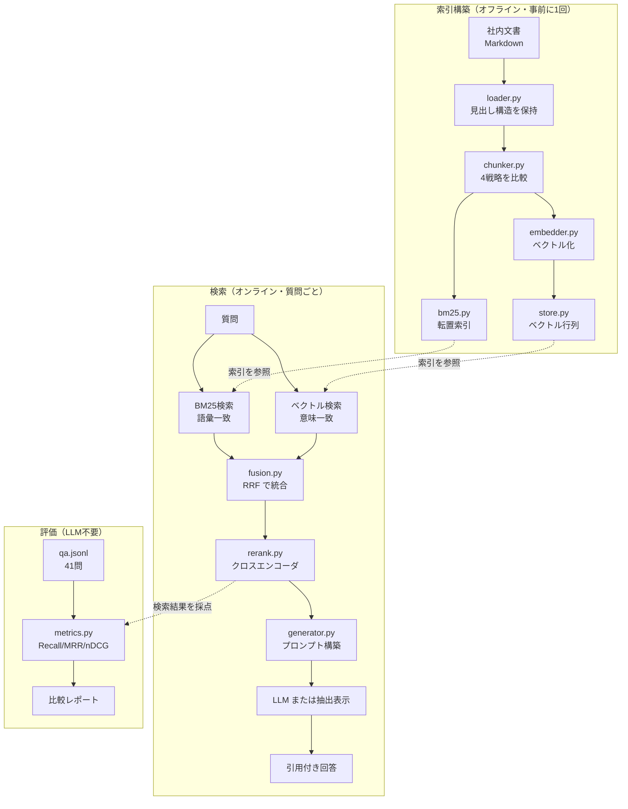

# rag-workshop

**RAG（検索拡張生成）の仕組みを、ライブラリを使わず自分で実装して学ぶためのリポジトリです。**

社内文書検索を題材に、RAG の各工程を一つずつ自前で書いています。
ベクトルDBも LangChain も使いません。Chroma / FAISS / LangChain が
内部で何をしているのかを、自分の手で書いて確かめるのが目的です。

検索の中核（BM25・ベクトルストア・RRF・評価指標）はすべて 30〜80 行のスクラッチ実装。
APIキーは不要で、費用もかかりません。

> **`data/corpus/` の文書はすべて架空です。**
> 検索の難しさを再現するために作成した学習用のダミー文書であり、
> 実在する組織の規程ではありません。業務上の判断に用いないでください。

---

## 目的別の読みはじめ方

| やりたいこと | 読むもの |
|---|---|
| **RAG がどういう仕組みか知りたい** | [docs/はじめに.md](docs/はじめに.md) — 専門用語を使わない入門 |
| **とりあえず動かしたい** | 下の「クイックスタート」 |
| **段階的に手を動かして学びたい** | [steps/](steps/) — Step 1 から順に実行する |
| **答え合わせをしたい** | [docs/検証レポート.md](docs/検証レポート.md) — 実測結果（**ネタバレ**） |
| **人に説明したい** | [docs/RAGとは.pptx](docs/RAGとは.pptx) — 発表用スライド10枚 |

用語で詰まったら [用語集](docs/はじめに.md#5-用語集) を引いてください。

---

## この検証のゴール

**先に「何ができれば成功か」を決めてから測ります。** これを決めずに数字を眺めても、
良くなったのか判断できません。

| | |
|---|---|
| **やること** | 社内文書について質問したら、答えが書いてある箇所を見つけてくる |
| **テスト質問** | ① 在宅勤務の手当はいくらですか<br>② 家で働くとお金はもらえますか |
| **正解** | `01_remote_work`（リモートワーク規程）の「6. 通信費および設備の補助」 |
| **合格条件** | **両方の質問で、正解が上位 3 件以内に出ること** |

①と②は同じことを聞いています。②は「在宅勤務」「手当」という語を一つも使っていません。
**言い換えられても見つけられるか**を見るためです。

上位3件としたのは、AI に渡すのがその数件だからです。
そこに入っていなければ、AI は原理的に答えられません。

この条件は `steps/goal.py` に書いてあり、各 Step が実行時に自分で合否を表示します。
**結果を先に見ずに、自分で動かして確かめてください。**

---

## 動作環境

| | 必要なもの |
|---|---|
| **Python** | **3.9 以上**（3.9.6 で動作確認） |
| **空き容量** | **約 1.6GB**（ライブラリ 640MB ＋ モデル 941MB） |
| **メモリ** | **2GB 以上の空き**（実測の最大使用量 1.5GB） |
| **ネットワーク** | 初回のみ必要（ライブラリ 149MB ＋ **モデル 941MB** をダウンロード） |
| **GPU** | **不要**。すべて CPU で動く |
| **APIキー** | **不要**。回答生成に外部APIを使うとき（`--llm`）だけ必要 |

Apple M4 / 16GB での実測値です。

| 操作 | 所要時間 | メモリ |
|---|---|---|
| ライブラリのインストール | 約 30 秒 | — |
| `step1`（モデル不要） | 1 秒未満 | 100MB 未満 |
| `step2`（埋め込みモデル） | 約 14 秒 | 1.0GB |
| `step4`（＋並べ替えモデル） | 約 60 秒 | 1.5GB |

**モデルのダウンロードは初回だけ**です（`~/.cache/huggingface` に保存され、以後は再利用）。
2回目からは毎回の通信確認も省けます。

```bash
export HF_HUB_OFFLINE=1
```

Windows / Linux でも動くはずですが、**動作確認は macOS のみ**です。
Windows では `./.venv/bin/python` を `.venv\Scripts\python` に読み替えてください。

---

## クイックスタート

### コマンドの読み方

このリポジトリのコマンドは、だいたいこの形です。

```
./.venv/bin/python  実行したいファイル
└──────┬──────┘
  このプロジェクト専用の Python
```

**なぜ `python3` ではなく `./.venv/bin/python` なのか。**
必要なライブラリをパソコン全体に入れると他のプロジェクトと衝突することがあるため、
**このフォルダの中だけに専用の Python 環境**（`.venv`）を作って、そこに入れます。
`python3` と打つとパソコン共通の方が動いてしまい、`numpy が見つかりません` になります。

`./` は「いまいるフォルダの」という意味です。

---

### 1. ライブラリを入れる（初回のみ・約30秒）

```bash
python3 -m venv .venv && ./.venv/bin/pip install -r requirements.txt
```

| 部分 | 意味 |
|---|---|
| `python3 -m venv .venv` | **専用の Python 環境を `.venv` という名前で作る** |
| `&&` | 前が成功したら次を実行する |
| `./.venv/bin/pip install` | **作った環境の中にライブラリを入れる** |
| `-r requirements.txt` | 入れるものの一覧はこのファイルに書いてある |

終わると `.venv` フォルダ（約640MB）ができます。**やり直したいときは、このフォルダごと消せば元に戻ります。**

> **⚠️ この時点では、まだ AI モデル本体は入っていません。**
> `requirements.txt` に書いてあるのは「モデルを**動かすためのプログラム**」だけです。
> モデルの中身（重み）は、**初めて使ったときに自動でダウンロード**されます（次項）。

### 1.5 モデルを先に取得しておく（任意・約1.1GB）

`step2` 以降で初めて使うときに自動でダウンロードされるので、**この手順は省略できます。**
ただし発表前やネットワークが遅い環境では、先に済ませておくと安心です。

```bash
./.venv/bin/python -c "from sentence_transformers import SentenceTransformer, CrossEncoder; SentenceTransformer('intfloat/multilingual-e5-small'); CrossEncoder('cross-encoder/mmarco-mMiniLMv2-L12-H384-v1'); print('取得完了')"
```

| | |
|---|---|
| **取得するもの** | 意味を数値化するモデル（470MB）／ 並べ直すモデル（470MB） |
| **保存先** | `~/.cache/huggingface`（**リポジトリの外**。他のプロジェクトとも共有される） |
| **アカウント** | **不要**。ログインなしで取得できる |
| **2回目以降** | ダウンロードなし。ローカルから読み込むだけ |

リポジトリを消してもモデルは残ります。不要になったら次で削除できます。

```bash
rm -rf ~/.cache/huggingface/hub/models--intfloat--multilingual-e5-small ~/.cache/huggingface/hub/models--cross-encoder--mmarco-mMiniLMv2-L12-H384-v1
```

### 2. まず動かす（モデル不要・すぐ終わる）

```bash
./.venv/bin/python steps/step1_naive_rag.py
```

**工夫を何もしない RAG を動かします。** AIモデルを一切使わないので、ダウンロードも待ち時間もありません。
2つの質問を検索し、最後に**合格・不合格の判定**が出ます（Step 1 は不合格になります）。

以降のコマンドは**リポジトリ直下で実行**してください（`data/corpus` を相対パスで読むため）。

### 3. 全構成をまとめて測る（数分かかる）

```bash
./.venv/bin/python -m evaluation.run_eval --cross-encoder
```

| 部分 | 意味 |
|---|---|
| `-m evaluation.run_eval` | **`evaluation` フォルダの `run_eval` を実行する**（`-m` はファイル名でなくモジュール名で指定する書き方） |
| `--cross-encoder` | 重い「並べ直し」構成も評価に含める。**外すと速く終わります** |

**16通りの構成を41問で採点し、`reports/` に結果を保存します。**
初回はモデルのダウンロード（941MB）が入るため時間がかかります。

### 4. 自分で質問してみる（ターミナル）

```bash
./.venv/bin/python demo.py
```

**対話形式で質問を投げられます。** 質問を入力すると、見つかった文書と根拠が表示されます。
空行か `Ctrl-D` で終了します。

### 5. ブラウザのチャット画面で試す

```bash
./.venv/bin/python app.py
```

**簡易サーバが立ち上がります。** `http://localhost:8000` を開いてください。
止めるときは `Ctrl-C` です。

「全構成を比較」ボタンで、**同じ質問に対する5構成の1位と速度を並べて見られます。**
例えば「VaultTeamって何ですか」で比較すると、並べ直しの構成だけが正解に辿り着き、
検索時間は 0.1ms → 296ms と3桁変わります。**精度と速度が引き合うことを1画面で示せます。**

Webフレームワークは使わず、Python 標準の `http.server` だけで書いてあります（202行）。

---

### 補足

`--llm` を付けたときだけ Claude API を使います（`ANTHROPIC_API_KEY` が必要）。
付けなければ検索結果をそのまま整形して表示するので、**費用はかかりません。**

```bash
./.venv/bin/python app.py --llm
```

2回目以降は、毎回の通信確認を省けます。

```bash
export HF_HUB_OFFLINE=1
```

---

## 段階的に学ぶ（steps/）

各ファイルは単独で実行でき、末尾に「考えてほしいこと」が付いています。

**Step 1 から順に実行してください。** 各 Step は上のゴールに対する合否を最後に表示します。

| ファイル | 何を変えるか |
|---|---|
| `step1_naive_rag.py` | 何も工夫しない。全工程をいちばん雑に |
| `step2_chunking.py` | 文書の切り方を変える |
| `step3_hybrid.py` | 探し方を 2 種類使って混ぜる |
| `step4_rerank.py` | 見つけた候補を並べ直す |
| `step5_evaluate.py` | 41 問で測り直す |

```bash
HF_HUB_OFFLINE=1 ./.venv/bin/python steps/step1_naive_rag.py
```

出力の最後に、こう表示されます。

```
判定 : Step 1（300字でぶつ切り＋文字の一致だけで探す）
  × 在宅勤務の手当はいくらですか         正解は    4位
  × 家で働くとお金はもらえますか         正解は   27位
  → 不合格（合格条件: 全問で上位 3 件以内）
```

**合格・不合格が変わる瞬間を、自分の目で見てください。**
どこで合格に転じ、どこで一度不合格に戻るのか。その理由を考えるのがこの教材の本体です。

各ファイルの末尾には「考えてほしいこと」が付いています。
答えを見る前に、まず自分で予想を立ててから次の Step に進んでください。

`step1` は `ragkit` を使わず標準ライブラリだけで書いてあるので、
**1ファイルで RAG の全体像を追えます。**

### 自分で条件を変えてみる

`steps/goal.py` のテスト質問や合格ラインは自由に書き換えられます。
質問を足す、上位 3 件を 1 件に厳しくする、別の文書を正解にする——
**条件を変えると結論がどう動くかを見るのが、いちばん勉強になります。**

---

## アーキテクチャ



設計上の要点は3つ。

**索引構築と検索の分離。** 埋め込みは索引構築時に1回だけ行う。
検索時に必要なのはクエリ1本のベクトル化（実測 6ms）だけで、文書側は計算済み。
バイエンコーダを使う理由はここにある。

**検索器の合成可能性。** すべての検索器が `search(query, top_k) -> [(index, score)]` を実装する。
ハイブリッドもリランクも「検索器を包む検索器」として書けるため、
構成の組み替えが1行で済み、公平な比較ができる。

**生成レイヤの差し替え可能性。** 生成器を変えても検索精度は1ミリも変わらない。
逆に検索が正解を拾えなければ、どんなモデルでも正しく答えられない。
この非対称性を実装の形で示すために、生成を末端の差し替え点に隔離している。

---

---

## ディレクトリ構成

```
rag-workshop/
├── ragkit/                  # RAG の部品（すべて自前実装）
│   ├── loader.py            # 見出し構造を保持した文書読み込み
│   ├── chunker.py           # チャンク戦略 4種
│   ├── tokenize_ja.py       # 形態素解析器なしの日本語トークナイズ
│   ├── bm25.py              # BM25 + 転置索引
│   ├── embedder.py          # TF-IDF / LSA / E5 の3バックエンド
│   ├── store.py             # ベクトルストア（numpy 30行）
│   ├── fusion.py            # RRF / 加重和
│   ├── rerank.py            # MMR / クロスエンコーダ
│   ├── retriever.py         # 検索器の統一インターフェース
│   ├── generator.py         # 抽出型 / Claude API
│   └── pipeline.py          # 全体の組み立て
├── evaluation/
│   ├── metrics.py           # Recall / Precision / MRR / nDCG
│   ├── dataset.py           # 評価セット読込 + 整合性検証
│   ├── configs.py           # 比較対象16構成の定義
│   ├── run_eval.py          # 一括評価 → reports/
│   ├── run_guard.py         # 回答不能質問の検出評価
│   └── test_metrics.py      # 指標自体の回帰テスト
├── data/
│   ├── corpus/              # 疑似社内文書 6件（規程・FAQ・ガイドライン）
│   └── eval/qa.jsonl        # 評価用 41問（正解セクション付き）
├── steps/                   # 段階的に理解するためのウォークスルー
│   ├── step1_naive_rag.py   # 1ファイル完結の素朴な RAG
│   ├── step2_chunking.py    # チャンク戦略で結果がどう変わるか
│   ├── step3_hybrid.py      # BM25と密ベクトルの補完性、RRFの計算
│   └── step4_rerank.py      # 2段構えの意味、候補数の決め方
├── app.py / web/index.html  # ブラウザで動くチャットデモ
├── demo.py                  # ターミナルの対話デモ
└── reports/                 # 評価結果（自動生成）
```

`evaluation/dataset.py` の `validate()` が、
存在しないセクションを正解に指定していないか起動時に検査する
（評価セットの typo は「アルゴリズムが悪い」と誤診させる最大の原因）。

---

---

## 自分の文書で試す

1. `data/corpus/` に Markdown を置く（`## ` 見出しで構造化されているほど精度が出る）。
   frontmatter に `doc_id` / `title` / `updated` / `owner` を書くと引用に反映される。
2. `data/eval/qa.jsonl` に質問と「正解がどこに書いてあるか」を書く。
   **20問あれば構成間の優劣は見える。** ここが最も価値の高い資産になる。
3. `./.venv/bin/python -m evaluation.run_eval` で比較する。

起動時に評価セットの整合性を検査します（存在しない見出しを正解に指定していないか、
正解セクションが期待キーワードを含むか）。
**評価セットの誤りは「アルゴリズムが悪い」と誤診させる最大の原因**のため、
毎回自動で確認しています。

⚠️ 実際の社内文書を入れる場合、このリポジトリを公開リモートに push しないでください。

---

## このリポジトリで扱っていないこと

- **ANN 索引**（HNSW / IVF）: 43チャンクでは全件走査で足りるため未実装。
  数十万件規模では必要になる。
- **クエリ変換**（HyDE / クエリ拡張 / マルチクエリ）: 次の改善候補。
  特に `distractor` 型が 0.88 で頭打ちなので、そこに効く可能性がある。
- **生成品質の評価**: 検索精度は数値化したが、生成の忠実性（faithfulness）は未評価。
  LLM-as-a-judge が必要で、API コストが発生する。
- **増分更新・削除**: 索引は毎回フルビルド。実運用では差分更新が要る。
- **権限制御**: 実際の社内文書検索では、閲覧権限によるフィルタが必須。
  `store.py` にメタデータフィルタを足す形になる。

---

## 参考にした概念の出典

- BM25: Robertson & Zaragoza (2009) *The Probabilistic Relevance Framework: BM25 and Beyond*
- RRF: Cormack et al. (2009) *Reciprocal Rank Fusion Outperforms Condorcet and Individual Rank Learning Methods*
- MMR: Carbonell & Goldstein (1998) *The Use of MMR, Diversity-Based Reranking*
- multilingual-e5: Wang et al. (2024) *Multilingual E5 Text Embeddings*
